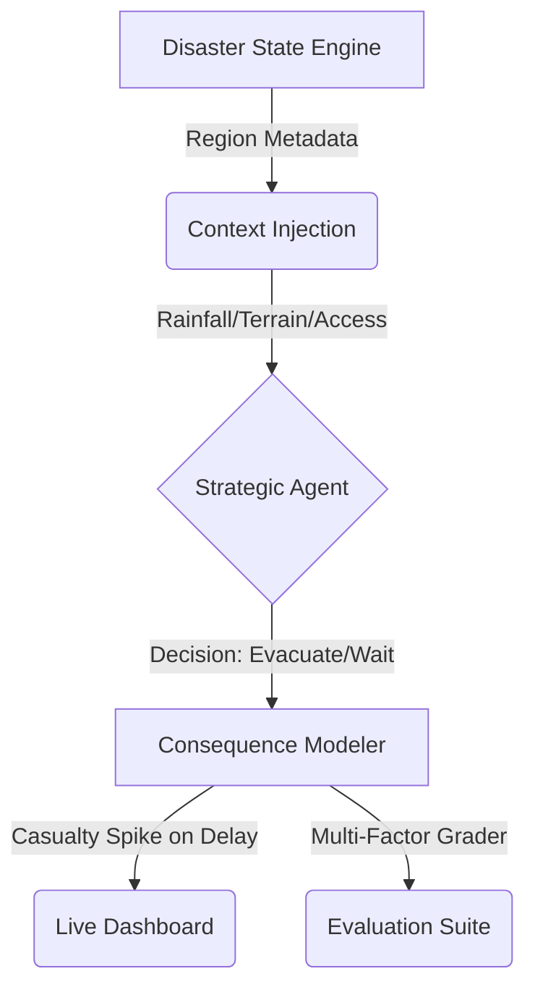

# 🏆 Disaster Response OpenEnv: Judge's Submission Guide

Welcome, Judges. This environment is built to solve one of the most critical gaps in AI Disaster Response: **High-Fidelity Decision Context**. 

Most agents fail in the real world because they lack situational awareness of terrain, infrastructure, and the **consequences of delay**. Our enhanced framework addresses this head-on.

---

## 🎨 System Architecture & Data Flow

---

## 🌍 Technical Deep-Dive: System Architecture

### 1. The Region Engine (Contextual Depth)
We don't just simulate "floods." We simulate **Assam's lowland river basin** vs. **Himachal's hilly landslide zones**.
- **Terrain Awareness**: High-altitude regions have different risk profiles than urban coastal ones.
- **Infrastructure Constraints**: When Roads are **BLOCKED**, our system evaluates if the agent specifies **Boats** or **Helicopters**, rewarding regional precision over generic actions.

### 2. Consequence Modeling (The "Stakes" Layer)
This is not a static simulator. Our **Consequence Engine** tracks **Cumulative Casualties**. 
- If an agent chooses to `wait` during a **CRITICAL** severity event, the system calculates a simulated casualty spike based on population density.
- This forces agents to weigh the risks of "Over-reaction" vs. "Fatal Delay."

### 3. The Multi-Factor strategic Grader
Our grading system is designed to reward nuanced, expert-level human decision logic:
- **Noise Immunity**: Rewards agents that ignore "Fake Urgency" alerts with low rainfall.
- **Method Match**: Rewards choosing the right resource for the terrain (e.g., Boats for Lowlands).
- **Reasoning Context**: Verifies if the agent's textual logic references the actual sensor telemetry (Altitude, Rainfall).

---

## 🚀 How to Evaluate (The Demo Flow)

### Step 1: Start the Engine
1. Load the backend: `python3 main.py`
2. Open Dashboard: `http://localhost:7860`

### Step 2: Observe the Dashboard
Notice the **Impact Panel**. Unlike standard datasets, our dashboard tracks **Population at Risk** and **Current Casualties** in real-time. Use the **Language Toggle** (English/Hindi) to see how we've localized this for on-the-ground deployment.

### Step 3: Run the Inference
Run the Gemini-powered agent: `python3 inference.py`. 
Watch the dashboard update. See the agent's reasoning flow through to the **Agent Insight** panel, highlighting its situational awareness.

---

## ✅ Compliance & Standards
- **OpenEnv v1.2** Standard Compliant.
- Fully Deterministic for reproducible benchmarking.
- **Privacy First**: `.env` configuration ensures no leaked credentials.

*Built for the Meta Hackathon - 2026 Disaster Response Track.*
